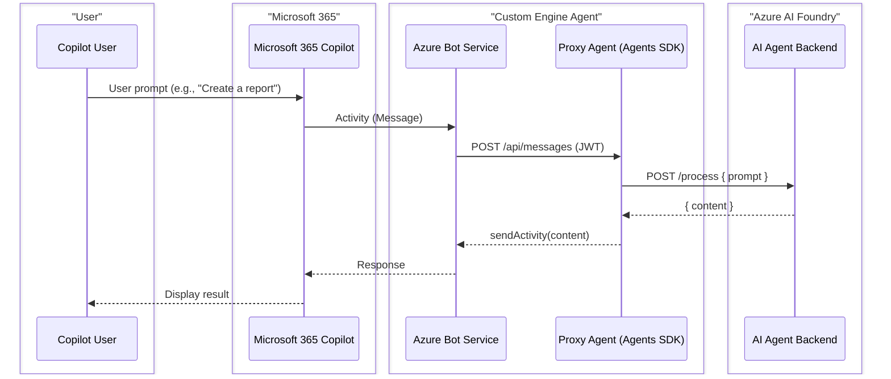
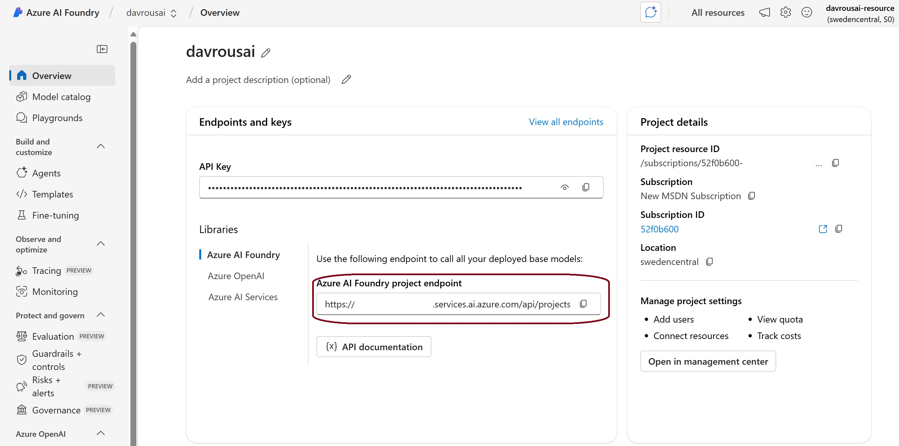
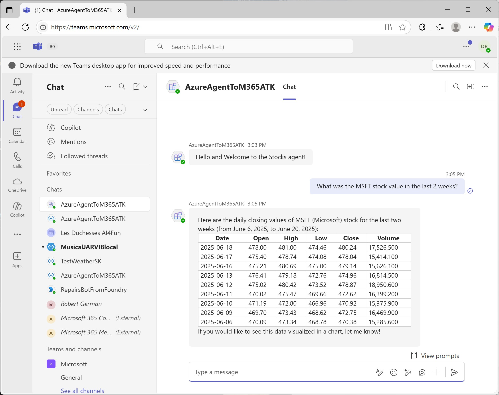
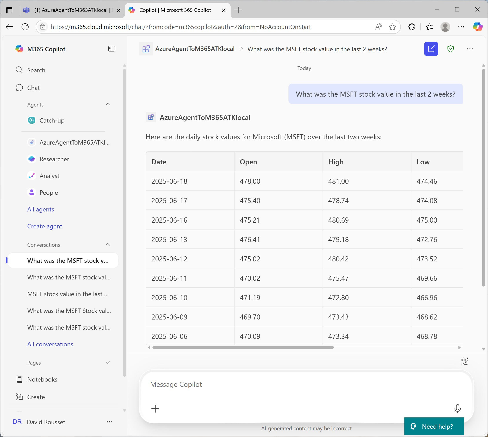
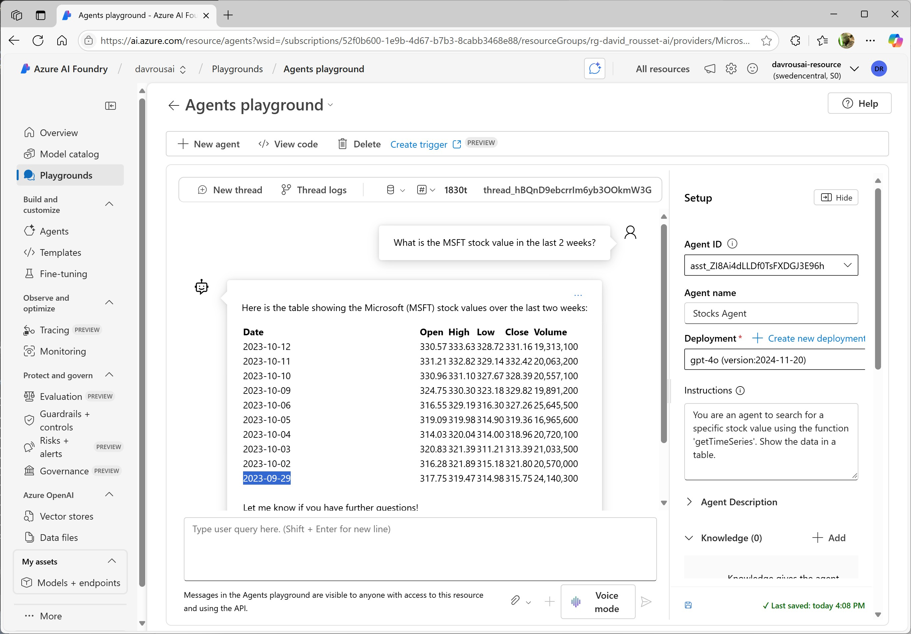
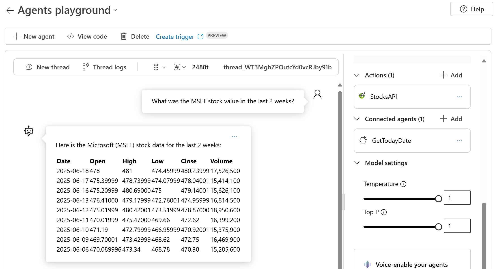
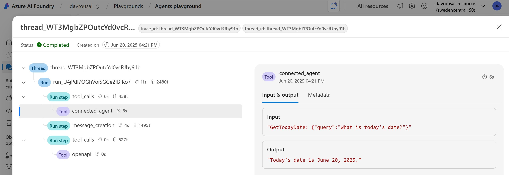

# Azure AI Foundry Agent for Microsoft 365

> **Making Azure AI Foundry Agents available in Microsoft 365 Copilot and Teams using the Microsoft 365 Agents Toolkit.**

This solution demonstrates how to integrate an Azure AI Foundry agent with Microsoft Teams and Microsoft 365 Copilot, providing a seamless experience for users to interact with powerful AI capabilities directly within their productivity tools.

[](https://www.youtube.com/watch?v=U9Yv2vjKYbI)

---

## 🔄 Architecture Flow



This proxy pattern allows you to:
- ✅ Connect existing AI agents to Microsoft 365 Copilot
- ✅ Maintain your AI logic in Azure AI Foundry
- ✅ Provide seamless user experience in Teams and Copilot
- ✅ Handle authentication and message routing automatically

---

## 🚀 Quick Start

Choose your deployment approach:

### Local Development (Debugging)
Perfect for development and testing with breakpoints and hot reload.

**See:** [M365Agent/LOCAL_DEPLOYMENT.md](M365Agent/LOCAL_DEPLOYMENT.md)

```powershell
# Start dev tunnel
devtunnel host

# Press F5 in VS Code or Visual Studio
# Test in Microsoft 365 Agents Playground
```

### Azure Production Deployment
Deploy your agent to Azure for production or dev environments.

**See:** [M365Agent/AZURE_DEPLOYMENT.md](M365Agent/AZURE_DEPLOYMENT.md)

```powershell
cd M365Agent
atk provision --env dev    # Provision Azure infrastructure
atk deploy --env dev        # Deploy your bot application
```

---

## 📋 Prerequisites

### Required Tools
- **.NET SDK 9.0** - [Download](https://dotnet.microsoft.com/download/dotnet/9.0)
- **Azure CLI** - [Install Guide](https://learn.microsoft.com/cli/azure/install-azure-cli)
- **Microsoft 365 Agents Toolkit CLI** - [Install Guide](https://aka.ms/m365agentstoolkit-cli)
- **Visual Studio 2022** (17.14+) or **VS Code** with C# Dev Kit

### Required Services
- **Azure AI Foundry Project** with a configured agent
- **Microsoft 365 tenant** with Teams or Copilot access
- **Azure subscription** with appropriate permissions

---

## 🏗️ Solution Architecture

This solution consists of two main components:

### 1. Bot Application (`AzureAgentToM365ATK/`)
.NET 9 bot application that serves as a proxy between Microsoft 365 and Azure AI Foundry.

**Key Features:**
- Connects to Azure AI Foundry Agent Service
- Handles user authentication and SSO
- Manages conversation threads and message routing
- Built on Bot Framework SDK

### 2. M365 Agents Toolkit Project (`M365Agent/`)
Infrastructure and configuration for Microsoft 365 integration.

**Includes:**
- Bicep templates for Azure infrastructure deployment
- Teams app manifest configuration
- Environment configuration files
- Automated provisioning and deployment workflows

```
ProxyAgent/
├── AzureAgentToM365ATK/          # C# Bot Application (.NET 9)
│   ├── Program.cs                 # Bot setup and configuration
│   ├── Agents/
│   │   └── AzureAgent.cs          # Azure AI Foundry integration
│   ├── appsettings.json           # Configuration
│   └── appsettings.Development.json  # Local dev settings
│
├── M365Agent/                     # Microsoft 365 Agents Toolkit Project
│   ├── appPackage/                # Teams app package
│   │   ├── manifest.json          # App manifest template
│   │   └── build/                 # Generated manifests
│   ├── infra/                     # Infrastructure as Code
│   │   ├── azure.bicep            # Production deployment
│   │   ├── azure-local.bicep      # Local development
│   │   └── modules/               # Reusable Bicep modules
│   ├── env/                       # Environment variables
│   │   ├── .env.dev               # Azure environment
│   │   └── .env.local             # Local environment
│   ├── m365agents.yml             # Production orchestration
│   ├── m365agents.local.yml       # Local orchestration
│   ├── AZURE_DEPLOYMENT.md        # 📘 Azure deployment guide
│   └── LOCAL_DEPLOYMENT.md        # 📘 Local development guide
│
├── images/                        # Screenshots and diagrams
└── README.md                      # This file
```

---

## 📚 Documentation

### Deployment Guides

| Guide | Purpose | When to Use |
|-------|---------|-------------|
| **[LOCAL_DEPLOYMENT.md](M365Agent/LOCAL_DEPLOYMENT.md)** | Complete local development setup with debugging | Development, testing, and debugging with breakpoints |
| **[AZURE_DEPLOYMENT.md](M365Agent/AZURE_DEPLOYMENT.md)** | Complete Azure production deployment | Production, staging, or shared dev environments |

### Technical References

| Document | Purpose |
|----------|---------|
| **[GUID_ENCODER_GUIDE.md](M365Agent/infra/modules/GUID_ENCODER_GUIDE.md)** | GUID encoding for federated credentials |
| **[BOT_OAUTH_CONNECTION.md](M365Agent/infra/modules/BOT_OAUTH_CONNECTION.md)** | OAuth connection configuration |

---

## ⚙️ Configuration

### Azure AI Foundry Setup

1. **Create an Agent in Azure AI Foundry Portal:**
   - Configure the model (GPT-4, GPT-4 Turbo, etc.)
   - Set instructions and personality
   - Add tools and capabilities (Code Interpreter, Functions, etc.)
   - Note the Agent ID (starts with `asst_...`)

2. **Get Connection Details:**
   - Project Endpoint URL
   - Agent ID
   
   

3. **Update Configuration:**
   
   Edit `AzureAgentToM365ATK/appsettings.json`:
   ```json
   {
     "AzureAIFoundryProjectEndpoint": "https://your-project.cognitiveservices.azure.com/",
     "AgentID": "asst_..."
   }
   ```

### Authentication

The bot uses **Azure Managed Identity** (production) or **Single Tenant + Client Secret** (local development) to authenticate with Azure AI Foundry.

**Local Development:**
```json
{
  "MicrosoftAppType": "SingleTenant",
  "MicrosoftAppId": "<bot-app-id>",
  "MicrosoftAppPassword": "<client-secret>",
  "MicrosoftAppTenantId": "<tenant-id>"
}
```

**Production (Managed Identity):**
```json
{
  "MicrosoftAppType": "UserAssignedMSI",
  "MicrosoftAppId": "<managed-identity-client-id>",
  "MicrosoftAppTenantId": "<tenant-id>"
}
```

---

## 🎯 Usage Scenarios

### In Microsoft Teams



1. Install the app in Teams (via app package upload)
2. Start a chat with the bot
3. Ask questions or give commands
4. The bot routes requests to your Azure AI Foundry agent
5. Get AI-powered responses with context awareness

### In Microsoft 365 Copilot



1. Access via https://m365copilot.com/
2. Find your agent in the left sidebar
3. Click "Open with Copilot"
4. Use natural language to interact with your Azure AI Foundry agent
5. Seamless integration with other M365 services

---

## 🔧 Development Workflow

### Local Development Cycle

1. **Start Dev Tunnel** (for Teams connectivity)
   ```powershell
   devtunnel host
   ```

2. **Run Bot Locally** (F5 in VS Code/Visual Studio)
   - Set breakpoints in your code
   - Test in Microsoft 365 Agents Playground
   - Iterate quickly without deployment

3. **Test in Teams** (optional)
   - Install app package in Teams
   - Test end-to-end flow
   - Debug with full context

### Deployment to Azure

1. **Configure Environment**
   ```bash
   # Edit M365Agent/env/.env.dev
   AZURE_SUBSCRIPTION_ID=<your-subscription-id>
   RESOURCE_SUFFIX=prod123
   ```

2. **Provision Infrastructure**
   ```powershell
   cd M365Agent
   atk provision --env dev
   ```

3. **Deploy Application**
   ```powershell
   atk deploy --env dev
   ```

4. **Install in Teams/Copilot**
   - Upload app package from `M365Agent/appPackage/build/`
   - Test in production environment

---

## 🌟 Features

### ✅ Single Sign-On (SSO)
- Seamless authentication with federated credentials
- No additional login prompts for users
- Secure token exchange

### ✅ Managed Identity (Production)
- No passwords or secrets to manage
- Automatic credential rotation
- Enhanced security posture

### ✅ Infrastructure as Code
- Repeatable deployments with Bicep
- Version-controlled infrastructure
- Easy environment replication

### ✅ Full Debugging Support
- Set breakpoints in VS Code/Visual Studio
- Hot reload for rapid iteration
- Local testing with real Teams integration

### ✅ Multi-Environment Support
- Separate configurations for local, dev, staging, production
- Environment-specific settings
- Isolated deployments

---

## 💰 Cost Estimates

### Local Development
- **Azure Bot Service (F0):** Free (up to 10,000 messages/month)
- **No App Service costs** (running locally)
- **Total:** ~$0/month

### Azure Production (Basic)
- **App Service Plan (B1):** ~$13/month
- **Bot Service (F0):** Free
- **Managed Identity:** Free
- **Total:** ~$13/month

### Azure Production (Standard)
- **App Service Plan (S1):** ~$70/month
- **Bot Service (S1):** ~$0.50 per 1,000 messages
- **Application Insights:** ~$2-10/month (if enabled)
- **Total:** ~$70-100/month

**See detailed cost breakdown in:** [AZURE_DEPLOYMENT.md](M365Agent/AZURE_DEPLOYMENT.md#cost-estimates)

---

## 🔍 Troubleshooting

### Bot Not Responding
- ✅ Check dev tunnel is running (local) or App Service is started (Azure)
- ✅ Verify bot endpoint in Azure Bot Service configuration
- ✅ Check application logs for errors
- ✅ Verify Azure AI Foundry agent is accessible

### SSO Not Working
- ✅ Check `webApplicationInfo` in app manifest
- ✅ Verify federated credentials in Entra ID app registration
- ✅ Check pre-authorized clients include Teams client IDs
- ✅ Review OAuth connection configuration

### Deployment Failures
- ✅ Verify Azure CLI login and subscription access
- ✅ Check required permissions (Contributor + Application Administrator)
- ✅ Review Bicep deployment errors in Azure Portal
- ✅ Ensure resource names are unique

**Full troubleshooting guides:**
- [Local Development Troubleshooting](M365Agent/LOCAL_DEPLOYMENT.md#troubleshooting)
- [Azure Deployment Troubleshooting](M365Agent/AZURE_DEPLOYMENT.md#troubleshooting)

---

## 📖 Additional Resources

### Microsoft 365 Agents Toolkit
- [Microsoft 365 Agents Toolkit Documentation](https://aka.ms/teams-toolkit-docs)
- [Microsoft 365 Agents Toolkit GitHub](https://github.com/OfficeDev/TeamsFx)
- [Teams App Development Guide](https://learn.microsoft.com/microsoftteams/platform/)

### Azure AI Foundry
- [Announcing Developer Essentials for Agents and Apps in Azure AI Foundry](https://devblogs.microsoft.com/foundry/announcing-developer-essentials-for-agents-and-apps-in-azure-ai-foundry/)
- [Azure AI Foundry Agent Service (General Availability)](https://techcommunity.microsoft.com/blog/azure-ai-services-blog/announcing-general-availability-of-azure-ai-foundry-agent-service/4414352)
- [Azure AI Foundry Documentation](https://learn.microsoft.com/azure/ai-services/)

### Bot Framework
- [Bot Framework SDK for .NET](https://github.com/microsoft/botbuilder-dotnet)
- [Azure Bot Service Documentation](https://learn.microsoft.com/azure/bot-service/)
- [Connect a bot to Twilio (SMS)](https://learn.microsoft.com/azure/bot-service/bot-service-channel-connect-twilio?view=azure-bot-service-4.0)
- [Connect a bot to Slack](https://learn.microsoft.com/azure/bot-service/bot-service-channel-connect-slack?view=azure-bot-service-4.0)

### Tutorials & Labs
- [Build your own agent with the M365 Agents SDK and Semantic Kernel](https://microsoft.github.io/copilot-camp/pages/custom-engine/agents-sdk/)
- [Video Tutorial: Azure AI Foundry Agent in M365 Copilot](https://www.youtube.com/watch?v=U9Yv2vjKYbI)

---

## 🎓 Tutorial: Creating a Stock Agent in Azure AI Foundry

This tutorial shows you how to create the same Stock Agent demonstrated in the video and screenshots above.

### Overview

The Stock Agent retrieves historical stock market data using an external API and displays it in a conversational format. It demonstrates:
- ✅ OpenAPI tool integration
- ✅ API key authentication
- ✅ Multi-agent orchestration
- ✅ Code Interpreter for date calculations

---

### Step 1: Create the Main Stocks Agent

Create a new Agent in Azure AI Foundry Portal with the following details:

- **Name:** `Stocks Agent`
- **Deployment:** GPT-4o, GPT-4.1, or GPT-4 Turbo
- **Instructions:**
  ```
  You are an agent to search for a specific stock value using the function 'getTimeSeries'. 
  Show the data in a table except if there is a unique value returned. 
  end_date MUST be strictly superior to start_date, never send the same value for the 2 parameters.
  ```
- **Agent Description:** `Retrieve the value of a stock at a specific time`

---

### Step 2: Create API Connection for Authentication

The Stock API requires authentication via API key. We'll create a secure connection to manage this.

1. **Get an API Key:**
   - Visit [Twelve Data](https://support.twelvedata.com/en/articles/5335783-trial)
   - Register for a free API key **OR** use the demo key `demo` (limited to AAPL stock only)

2. **Create Connection in Azure AI Foundry:**
   - Go to **Management Center** → **New connection**
   - Choose **Custom keys** at the end of the selection page
   - Create key-value pair:
     - **Name:** `apikey`
     - **Value:** Your API key or `demo`
     - ✅ Check **"is secret"**
   - **Connection Name:** `StockAPI`
   - Click **Save**

---

### Step 3: Add OpenAPI Tool to the Agent

Go back to your **Stocks Agent** in the Azure AI Foundry project portal.

1. Click **Add an Action** → **OpenAPI 3.0 specified tool**

2. **Configure the tool:**
   - **Name:** `StocksAPI`
   - **Description:** `API for retrieving historical time series data for financial instruments with optional filters like start_date, end_date, and outputsize.`
   - **Authentication method:** Select **Connection** → Choose **StockAPI**

3. **Copy/paste the following OpenAPI specification:**
```json
{
  "openapi": "3.0.3",
  "info": {
    "title": "Twelve Data Time Series API",
    "description": "API for retrieving historical time series data for financial instruments with optional filters like `start_date`, `end_date`, and `outputsize`.",
    "version": "1.0.0"
  },
  "servers": [
    {
      "url": "https://api.twelvedata.com"
    }
  ],
  "paths": {
    "/time_series": {
      "get": {
        "summary": "Retrieve historical time series data",
        "description": "Retrieves historical time series data for a specified financial instrument.  The `start_date` and `end_date` parameters can be used to define boundaries for the data.  The maximum number of data points in one request is 5000.",
        "parameters": [
          {
            "name": "symbol",
            "in": "query",
            "required": true,
            "description": "The symbol of the financial instrument (e.g., AAPL for Apple Inc.).",
            "schema": {
              "type": "string"
            }
          },
          {
            "name": "interval",
            "in": "query",
            "required": true,
            "description": "The time interval between data points (e.g., 1day, 1min).",
            "schema": {
              "type": "string"
            }
          },
          {
            "name": "start_date",
            "in": "query",
            "required": false,
            "description": "The start date of the time series data in ISO format (YYYY-MM-DD).  Must be greater than `outputsize` if used alone. Must be absolutely strictly inferior to `end_date`",
            "schema": {
              "type": "string",
              "format": "date"
            }
          },
          {
            "name": "end_date",
            "in": "query",
            "required": false,
            "description": "The end date of the time series data in ISO format (YYYY-MM-DD).  Defines the upper limit of the data range. Must be absolutely strictly superior to `start_date`",
            "schema": {
              "type": "string",
              "format": "date"
            }
          },
          {
            "name": "outputsize",
            "in": "query",
            "required": false,
            "description": "The number of data points to return.  Defaults to 30 if not specified. Maximum value is 5000.",
            "schema": {
              "type": "integer"
            }
          },
          {
            "name": "apikey",
            "in": "query",
            "required": true,
            "description": "Your API key for authentication.",
            "schema": {
              "type": "string"
            }
          }
        ],
        "responses": {
          "200": {
            "description": "A successful response with the time series data.",
            "content": {
              "application/json": {
                "schema": {
                  "type": "object",
                  "properties": {
                    "meta": {
                      "type": "object",
                      "description": "Metadata about the request and time series."
                    },
                    "values": {
                      "type": "array",
                      "description": "The list of time series data points.",
                      "items": {
                        "type": "object",
                        "properties": {
                          "datetime": {
                            "type": "string",
                            "format": "date-time",
                            "description": "The timestamp of the data point."
                          },
                          "open": {
                            "type": "number",
                            "description": "The opening price."
                          },
                          "high": {
                            "type": "number",
                            "description": "The highest price."
                          },
                          "low": {
                            "type": "number",
                            "description": "The lowest price."
                          },
                          "close": {
                            "type": "number",
                            "description": "The closing price."
                          },
                          "volume": {
                            "type": "integer",
                            "description": "The traded volume."
                          }
                        }
                      }
                    }
                  }
                }
              }
            }
          },
          "400": {
            "description": "Bad request due to invalid parameters."
          },
          "401": {
            "description": "Unauthorized, invalid API key."
          },
          "500": {
            "description": "Internal server error."
          }
        },
        "operationId": "getTimeSeries"
      }
    }
  },
  "components": {
    "securitySchemes": {
      "ApiKeyAuth": {
        "type": "apiKey",
        "in": "query",
        "name": "apikey"
      }
    }
  },
  "security": [
    {
      "ApiKeyAuth": []
    }
  ]
}
```
4. Click **Next** → **Create Tool**

---

### Step 4: Test the Agent (First Attempt)

Go to the **Playground** and test your agent:

```
You: "What was the MSFT stock value in the last 2 weeks?"
```



**Problem:** The agent doesn't know today's date, so the time period is incorrect!

---

### Step 5: Create Date Helper Agent

To fix this, we'll create a helper agent that can determine the current date using Code Interpreter.

1. **Create a new Agent:**
   - **Name:** `Get Today Date`
   - **Deployment:** GPT-4o, GPT-4.1, or GPT-4 Turbo
   - **Instructions:**
     ```
     Using the code interpreter feature, please find the current today date and 
     returns its value to be used by another agent
     ```
   - **Agent Description:** `Returns the current date`

2. **Add Code Interpreter:**
   - Click **Add an Action** → **Code Interpreter**
   - Use default parameters

---

### Step 6: Connect Helper Agent to Stocks Agent

1. Go back to your **Stocks Agent**
2. Click **Add a Connect agent**
3. **Select the agent:** `Get Today Date`
4. **Unique name:** `GetTodayDate`
5. **Steps to activate the agent:**
   ```
   Use this agent when you need to know the current today's date
   ```
6. Click **Add**

---

### Step 7: Test the Complete Solution

Go back to the **Playground** and ask the same question again:

```
You: "What was the MSFT stock value in the last 2 weeks?"
```



**Success!** The agent now correctly:
1. ✅ Calls the "Get Today Date" agent to determine the current date
2. ✅ Calculates the date range (last 2 weeks)
3. ✅ Calls the Stock API with correct parameters
4. ✅ Displays results in a formatted table

---

### Debugging Agent Execution

Click **Threads logs** in the Playground to see the execution flow:



This shows you:
- Which agents were invoked
- What tools were called
- The order of execution
- Parameters passed between agents

---

### Next Steps

Now that you have a working Stock Agent, you can:
- **Integrate with this solution** by updating `appsettings.json` with your agent details
- **Test in Teams** using the local deployment guide
- **Deploy to Azure** for production use
- **Extend functionality** by adding more tools or connected agents

**See:** [LOCAL_DEPLOYMENT.md](M365Agent/LOCAL_DEPLOYMENT.md) or [AZURE_DEPLOYMENT.md](M365Agent/AZURE_DEPLOYMENT.md)

---

## 🤝 Contributing

Contributions are welcome! Please feel free to submit issues or pull requests.

---

## 📄 License

This project is licensed under the terms specified in the [LICENSE](LICENSE) file.

---

## 💬 Support

For questions or issues:
- **GitHub Issues:** [Create an issue](https://github.com/ericsche/ProxyAgent/issues)
- **Microsoft Q&A:** [Teams Development](https://learn.microsoft.com/answers/topics/microsoft-teams.html)
- **Teams Toolkit Issues:** [OfficeDev/TeamsFx](https://github.com/OfficeDev/TeamsFx/issues)


